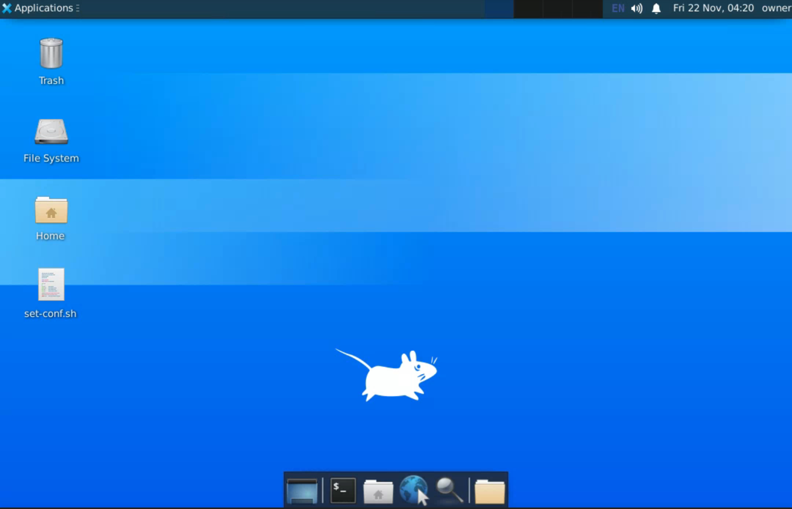
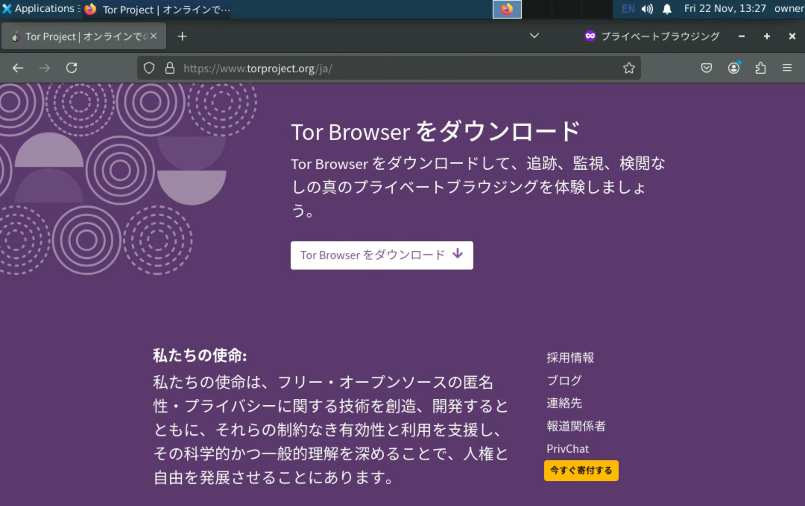

# ダークウェブの中に入ってみた！

どうも！ The Infinity'sです！

暇なので**ダークウェブ**に入ってみたいと思います！

## ダークウェブとは

日本語でいう「闇サイト」というもので、
[Tor](https://www.google.com/search?q=Tor) という技術を活用したりした
非常に匿名性の高い[www](https://www.google.com/search?q=World+Wide+Web)のことです。

政治的な理由で抑圧されていたり、
検閲を受けたりしているところからでも、
自由にネットワークにアクセスすることができます。

また、匿名性の高さを利用して、個人情報や違法薬物の売買等にも使用されています。

## 実際に繋げてみた

⚠︎⚠︎⚠︎⚠︎⚠︎⚠︎⚠︎⚠︎⚠︎⚠︎⚠︎⚠︎⚠︎⚠︎⚠︎⚠︎

以後の手順に従って何かしらの不利益を被った如何なる場合でも
私は責任を負いません。
自己責任でお願いします。

⚠︎⚠︎⚠︎⚠︎⚠︎⚠︎⚠︎⚠︎⚠︎⚠︎⚠︎⚠︎⚠︎⚠︎⚠︎⚠︎

### 1. VPNやプロキシを接続する(推奨)

これをすることでTor側に対してIPアドレスを隠すことが出来ます。
(VPNやプロキシ側には隠せないので注意)

### 2. Infinity Docker Desktopを準備する(任意)

[Infinity Docker Desktop](https://github.com/The-Infinitys/inf-docker-desktop) 
は、Dockerコンテナ内に
独立したデスクトップ環境を作成できます。
これによってお手元の環境とダークウェブに接続する環境を隔離して、
安全性を上げられます。
(出来れば仮想マシンを用意できると尚良い)

### 3. Torブラウザをインストールする

(以後の操作はInfinity Docker Desktopで動かした際を想定しています。)

先ず、ブラウザを開いて...

[Tor Browser](https://www.torproject.org)をダウンロードします。

そしてインストールします。

参考までにInfinity Docker Desktopでインストールする際のコマンドをお見せします。

### 4. Torブラウザを開く

